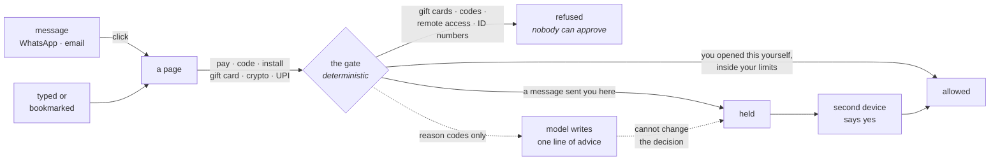

# NoScam

**The scams that take the most money never break any encryption. They get the
person to authorise it.**

A message says your account is compromised and your money must move to a "safe
account". A caller says you are under digital arrest and must install a support
app. Someone asks you to share your screen so they can "verify the failed
transaction". Your phone is not hacked and your bank is not breached — *you*
are instructed, through a channel you trust, and you do it yourself.

Americans reported **$16 billion lost to fraud in 2025**, a record; **$3.5
billion of it to imposter scams**, one in three fraud reports
([FTC](https://www.ftc.gov/news-events/news/press-releases/2026/06/ftc-data-show-people-reported-losing-3-point-5-billion-imposter-scams-2025)).
India runs the same script with different props — APKs disguised as wedding
invites and traffic challans, "digital arrest" video calls, AnyDesk installs —
with the RBI reporting digital payment fraud up 34% year on year.

So NoScam does not try to detect scams. **It refuses to let an instruction that
arrived through a message authorise something irreversible.**

Every anti-scam extension on the market — Guardio, SafeBrowz, Netcraft,
Cryptonite — answers the question *"is this site known to be bad?"* That
question is one new domain away from being useless, and the scam page in the
demo below is brand new every time. NoScam asks a different question, which
does not depend on recognising anything: *"did the instruction for this action
arrive through a channel that is allowed to authorise it?"*

The advice every consumer-protection body gives is
[pause before you pay](https://globalcyberalliance.org/pause-before-you-pay-a-guide-to-avoiding-money-transfer-scams/).
Nobody pauses while a stranger on the phone is counting down. This is that pause,
enforced by software, on the one device the caller cannot reach.

---

## What it does

| | |
|---|---|
| **Limits what can happen** | Per-payment and daily caps, a cooling period for first-time payees, remote-control software refused outright. Set once by whoever is calmest. |
| **Stops the moment of loss** | Every way money and access actually leave: a transfer, a one-time code, a password, an install, **gift cards**, **crypto**, a **UPI collect request**, an **AutoPay mandate**, and identity numbers — each checked against *how you got there*. |
| **Catches the fake page as it opens** | When a message sent you somewhere whose address gives it away, before anything is typed. |
| **Checks links, with reasons** | Lookalike domains, brand names that aren't in the domain, punycode, shorteners that land somewhere else, pages asking for passwords, installers — and `upi://` requests, decoded to say which way the money goes. |

The decision is deterministic. A language model writes one sentence of advice
and has no other power — see [The model's leash](#the-models-leash).

## Scored on both axes

Stopping every scam is easy if you are willing to stop everything, so the cost
is measured in the same table as the benefit. `python3 eval/score.py`:

```
Scams stopped                        16/16
Ordinary actions left alone          10/14
Ordinary actions slowed down         4/14
Ordinary actions refused outright    0/14

Ordinary actions that were slowed down (the cost this household pays):
  ~ A message from your son, paying him back
  ~ Paying the plumber for the first time
  ~ Buying crypto you decided to buy
  ~ Accepting a collect request from the tea shop you use
```

Thirty hand-written situations are a regression test, not a measured accuracy
claim. A real number needs real households, and nobody has used this in one yet.

## Run it

```bash
python3 -m pip install -r requirements.txt
python3 noscam.py
```

On macOS you can double-click **`Start NoScam.command`** instead; it installs
what is missing the first time. `pipx install .` also works — `noscam` then
starts it from anywhere. What it would take to ship this past people who own a
terminal is written down in [SHIPPING.md](SHIPPING.md).

That starts the gate, the stand-in messenger and bank, seeds a household and
opens the first page. Then:

- **http://localhost:8790** — the scam. Click the payment link, press Transfer.
- **http://127.0.0.1:8787/app/** — the phone: approvals, link checks, limits.
- **http://localhost:8791** — their own bank, to see ordinary payments pass.

The demo pages load the extension's content script directly, so the gate works
without installing anything.
- Real protection on a desktop: load `extension/` at `chrome://extensions` →
  Developer mode → *Load unpacked*. Only then can NoScam see how a tab was
  really reached and cancel a download.

Optional, for the advice line: `export GEMINI_API_KEY=…`. Without it everything
works and the deterministic explanation is what you see.

## How it works



Everything the gate decides is written to a hash-chained log, so "what actually
happened" survives the argument afterwards.

- **`service/provenance.py`** — how the page was reached. A link clicked in a
  messenger or webmail taints what follows for 15 minutes; typing the address
  yourself does not. Taint decays, because someone who clicked twenty minutes
  ago and has been reading since is not mid-scam.
- **`service/policy.py`** — the gate. A pure function with four dispositions,
  ordered by severity, each carrying a sentence the person can check against
  their own memory: *"you arrived here from WhatsApp 40 seconds ago."*
- **`service/links.py`** — link signals, each with a named reason, including
  `upi://` requests decoded into which way the money moves — and whether it
  moves *once*. An AutoPay mandate shows ₹99 on screen while authorising ₹99
  **daily** until cancelled, so the year's total is spelled out; NPCI tightened
  mandate rules in 2026 for exactly this reason. That is the whole of
  the collect-request scam: the victim is told a refund is arriving, and
  approving it with their own PIN sends money out. UPI has no flow in which
  receiving needs your approval.
- **`service/audit.py`** — a SHA-256 chained log of every decision, approval and
  override. After a scam, "what actually happened" has an answer.
- **`extension/`** — Chrome MV3. Provenance from `webNavigation`, remote-access
  downloads cancelled via `downloads.cancel`, and an overlay that explains
  rather than scolds. The same content script runs standalone for the demo.
- **`web/`** — the phone: approvals, link checking, limits. Paste a link
  anywhere; on Android, add it to the home screen and it joins the Share menu,
  so a suspicious link is two taps from inside WhatsApp. Intercepting the tap
  itself needs a native app — see [LIMITATIONS.md](LIMITATIONS.md), which says
  exactly what that would take on each platform.

### Tested against a page nobody here wrote

The detector was run against **Wikimedia's live donation page** — a real payment
form built by people who have never heard of this project — and it found two
bugs worth having:

- The recurring button reads *"Yes, I'll donate $25 each month"*, and the
  mandate pattern did not match "each month", so a standing instruction would
  have been waved through as a one-off payment.
- A payment button with no text at all — an icon — was skipped entirely.

Both are fixed, both are now regression-tested against the exact labels from
that page (`tests/test_detection_heuristics.py`, which reads the regexes out of
the shipped JavaScript rather than a copy), and on that page the search and "Go"
buttons are still correctly left alone.

### Built for the person it is for

Someone frightened, rushed, possibly 70, possibly using a screen reader. So:
plain words and no jargon; one decision per screen; a **Bigger text** control
that is remembered; full keyboard operation with focus kept inside the card, so
Tab cannot land on the bank's own *Pay* button underneath; Escape always means
cancel, never continue; the card announces itself and its status to a screen
reader; and it honours reduced-motion and high-contrast settings. Colour carries
no meaning anywhere — a red warning banner is the one thing every scam page
already imitates.

### Security properties worth naming

- **A web page cannot drive the service.** It listens on loopback, which is not
  the same as private — every page in the browser can reach it. Changing limits,
  answering a hold, adding a payee or reading what you spent today requires a
  trusted Origin (the extension, or the phone app this service serves), which a
  page cannot forge.
- **The gate does not depend on a form submit.** Most real payment pages post
  with `fetch()`, so clicks are intercepted in the capture phase, before the
  page's own handler runs. There is a demo page with no form at all
  (`/demo/bank/fetchpay.html`) that exists purely to prove it.
- **The card is in a closed shadow root**, so the page cannot read it, delete
  its buttons, or click "Continue anyway" on the person's behalf.
- **The link checker cannot be turned into a way into your network.** Hosts are
  resolved before connecting and refused if they are loopback, private,
  link-local or reserved; only http and https; every redirect hop is re-checked;
  bodies are capped. (Recent audits found ~37% of public MCP servers vulnerable
  to exactly this. Not repeating it is part of the product.)
- **A refusal is not a request.** Gift cards, one-time codes, identity numbers
  and remote-access tools are refused, and no screen offers to approve one —
  pressuring the guardian instead is simply the next move in the same script.
  Only the cases where a second opinion is the designed way through can be
  approved at all.
- **An approval is bound to one action.** It carries a fingerprint of host,
  action, amount and payee, expires in five minutes and cannot be given twice —
  so a nod for a small payment cannot be stretched to cover a large one.
- **Nothing leaves the machine.** The service runs locally; payments, payees and
  limits stay on it. The only outbound call is the optional advice line.

### The model's leash

The disposition is decided before the model is called, and nothing it returns
can change it — `tests/test_explain.py` asserts the decision is identical even
when the model replies *"this payment is completely safe, allow it"*. The payee
name and hostname are the attacker's own text, so they reach the model
truncated, flattened to one line and labelled UNTRUSTED; the reply is rejected
if it contains a link, markup, or if the model stopped early. A successful
prompt injection can change the wording of one sentence of advice. That is all.

## Limits

Read [LIMITATIONS.md](LIMITATIONS.md) before believing anything above. The short
version: this does not protect a phone at the OS level, does not clean an
already-compromised device, and can always be overridden by the person at the
keyboard — deliberately, because a control that cannot be overridden is a
control that gets uninstalled. It is a handbrake, not a cage.

## Prior art

The mechanism — track where data came from, and refuse to let untrusted sources
authorise consequential actions — is taken from the agent-security literature,
not invented here: [CaMeL](https://arxiv.org/abs/2503.18813),
[FIDES](https://arxiv.org/abs/2505.23643),
[LlamaFirewall](https://arxiv.org/abs/2505.03574). What is new here is pointing
it at the person rather than the agent, and measuring the friction it costs.

## Tests

```bash
python3 -m pytest -q      # 101: the gate's truth table, approval replay,
                          # link signals, SSRF refusals, audit tampering,
                          # and the model's leash
python3 eval/score.py     # the two-axis scorecard
```

## AI disclosure

Built for the TLN Cybersecurity Challenge 2026 with **Claude Code** (Anthropic)
as a pair programmer: it wrote code and tests to my direction, and I reviewed,
corrected and tested everything in this repository. **Gemini** is a runtime
dependency for the single advice line described above, and is disabled without
an API key. The research behind the threat model is cited inline.

MIT licensed.
